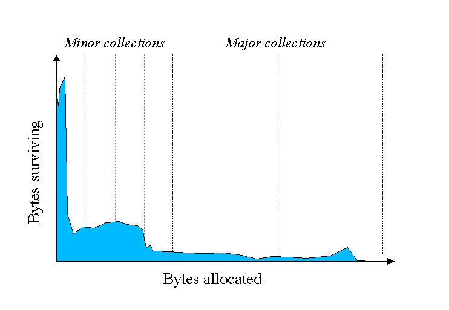
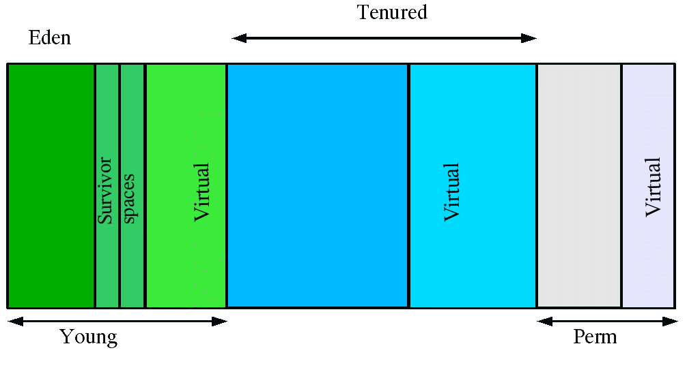

title: Java虚拟机GC调整
slug: jvm-gc-tuning
category: programming
tags: java,jvm,garbage collection
date: 2012-08-25

[TOC]

# Java垃圾回收介绍
我们先来看一张对象生存期的图。横轴是对象分配后的生存期，纵轴是相应生存期的字节总数。从这张图我们可以看出绝大多数对象的生存期是很短暂的。
比如程序中随处可见的局部变量。对于那些长期生存的变量，比如程序内部的计数器，cache等都需要长期占用内存，这些也就是图中右边的部分。当然这个图是对大多数程序的统计，不是所有的程序都符合这个图的，比如一个用java写的内存cache服务就可能完全不是这样的分布。

由于大多数程序具有上面所说的特征，所以jvm中的内存按照generation的方式进行管理。当一个generation被填满后，就会对这个generation进行回收。minor回收后仍然存活的对象会被迁移到major generation中。major generaiton满了之后也会进行一次回收。minor,major回收的代价是不同的，minor回收过程中大多数对象都是可以被释放的，而major回收的时候大多数对象都是不可释放的，所以major回收要比minor回收慢的多。由于分代管理的特点，我们在程序内存分配上也就会遇到分代分配内存来减少gc从而提供程序更好的性能。Java中的缺省的代分布大致如下（并行垃圾收集器除外）：

初始化的时候，最大的地址空间虚拟地保留住而没有分配出去，直到真的需要的时候为止。整个保留的对象地址空间被分给了年轻的和年老的代。

年轻代包括Eden Space和两个Survivor Space。大部分对象最初在Eden Space被分配出来。一个Survivor Space在任意时刻都是空的，作为Eden的活对象的目的地，另一个是用于下一次收集。对象在幸存者空间之间停留到足够老之后，就会被复制到Tenured Space去了。

另一个和Tenured Space有密切关系的代是永久代（permanent），这里保存着虚拟机需要的类和方法等元数据对象。

以上内容参考自[http://developer.51cto.com/art/201208/351690.htm](http://developer.51cto.com/art/201208/351690.htm)

通过在启动java程序的时候增加命令行参数-XX:+PrintGCDetails可以输出垃圾回收的信息。比如

	[GC [DefNew: 64575K->959K(64576K), 0.0457646 secs] 196016K->133633K(261184K), 0.0459067 secs] 

这个信息显示，这次小回收收回了 98% 的 DefNew 年轻代的数据，64575K->959K(64576K) 并在其上消耗了 0.0457646 secs（大约45毫秒）。整个堆的占用率下降了大约51％ 196016K->133633K(261184K)，而且通过最终的时间 0.0459067 secs 显示在垃圾收集中有轻微的开销（在年轻代之外的时间）。

## 垃圾回收算法

### 引用计数（Reference Counting）
比较古老的回收算法。原理是此对象有一个引用，即增加一个计数，删除一个引用则减少一个计数。垃圾回收时，只用收集计数为0的对象。此算法最致命的是无法处理循环引用的问题。

### 标记-清除（Mark-Sweep）
此算法执行分两阶段。第一阶段从引用根节点开始标记所有被引用的对象，第二阶段遍历整个堆，把未标记的对象清除。此算法需要暂停整个应用，同时，会产生内存碎片。

### 复制（Copying）
此 算法把内存空间划为两个相等的区域，每次只使用其中一个区域。垃圾回收时，遍历当前使用区域，把正在使用中的对象复制到另外一个区域中。次算法每次只处理 正在使用中的对象，因此复制成本比较小，同时复制过去以后还能进行相应的内存整理，不过出现“碎片”问题。当然，此算法的缺点也是很明显的，就是需要两倍 内存空间。

### 标记-整理（Mark-Compact）
此算法结合了 “标记-清除”和“复制”两个算法的优点。也是分两阶段，第一阶段从根节点开始标记所有被引用对象，第二阶段遍历整个堆，把清除未标记对象并且把存活对象 “压缩”到堆的其中一块，按顺序排放。此算法避免了“标记-清除”的碎片问题，同时也避免了“复制”算法的空间问题。

### 增量收集（Incremental Collecting）
实施垃圾回收算法，即：在应用进行的同时进行垃圾回收。不知道什么原因JDK5.0中的收集器没有使用这种算法的。

### 分代（Generational Collecting）
基于对对象生命周期分析后得出的垃圾回收算法。把对象分为年青代、年老代、持久代，对不同生命周期的对象使用不同的算法（上述方式中的一个）进行回收。现在的垃圾回收器（从J2SE1.2开始）都是使用此算法的

## GC的两种类型：Scavenge GC和Full GC。
### Scavenge GC
一般情况下，当新对象生成，并且在Eden申请空间失败时，就好触发Scavenge GC，堆Eden区域进行GC，清除非存活对象，并且把尚且存活的对象移动到Survivor区。然后整理Survivor的两个区。
### Full GC
对整个堆进行整理，包括Young、Tenured和Perm。Full GC比Scavenge GC要慢，因此应该尽可能减少Full GC。有如下原因可能导致Full GC：

* Tenured被写满
* Perm域被写满
* System.gc()被显示调用，这个一般我们会通过jvm参数禁止程序主动触发Full GC，因为可能的误用会导致很多不可知的问题无法追踪。
* 上一次GC之后Heap的各域分配策略动态变化

## Java Garbage Collector
### 串行收集器
单线程垃圾回收，适用于单处理器机器。开关:-XX: +UseSerialGC。这个在线上的服务中一般不会使用，效率太差。

### 并行收集器
对年轻代进行并行垃圾回收，因此可以减少垃圾回收时间。一般在多线程多处理器机器上使用。开关: -XX:+UseParallelGC。并行收集器在J2SE5.0更新6上引入，在Java SE6.0中进行了增强：可以堆年老代进行并行收集。如果年老代不使用并发收集的话，是使用单线程进行垃圾回收，因此会较慢，开关：-XX:+UseParallelOldGC。参数-XX:ParallelGCThreads=<N>可以控制并发回收的线程数目，一般设置成处理器个数。

### 并发收集器
这个处理器用cpu时间换取程序较少的延时，适合对响应时间要求比较高的应用中。开关：-XX:+UseConcMarkSweepGC。对于大型的线上WEB Server(tomcat,jetty)推荐使用这个并发收集器。

# 针对并发收集器的JVM GC参数调整

## jstat的使用
这是一个jvm统计信息监控工具，可以获取程序运行时的内存使用，gc相关的信息。详细请看[http://docs.oracle.com/javase/1.5.0/docs/tooldocs/share/jstat.html](http://docs.oracle.com/javase/1.5.0/docs/tooldocs/share/jstat.html)

### gcutil
格式jstat -gcutil pid sampling-interval
	
	jstat -gcutil 20181 10000
	S0     S1     E      O      P     YGC     YGCT    FGC    FGCT     GCT   
	0.00  59.83  21.57  52.84  60.82  18949   60.227    64    3.875   64.102
	71.31   0.00  48.04  53.15  60.82  18950   60.231    64    3.875   64.107
	0.00  35.37  88.95  53.53  60.82  18951   60.235    64    3.875   64.110

从输出的第二行可以看出，发生了一次YGC，S1和E的内存gc收集到S0。S1变成0了，E反而变大了，这跟我们采样的时间有关系，两次采样中，发生了一次GC，在这次GC的时候E肯定是变小了，但是后续又会慢慢变大。从gcutil的输出我们可以看出P,O,E区的变化情况，根据这个变化情况可以做JVM参数-Xms,-Xmx,-Xmn的调整。比如我一开始没有设置Perm区大小，导致Perm区占用90+%，会有不必要的Full GC因此产生，所以通过使用-XX:PermSize=64M调整了之后Perm区的使用就比较正常了60%左右。

-Xms,-Xmx最好设置成一样的值，这样可以避免每次垃圾回收后JVM重新分配内存。
-Xmn设置年轻代的大小，这个值对GC影响很大，Sun官方推荐配置为整个堆的3/8。

### gcnew
这个选项可以统计新生代的使用情况。输出格式说明见[http://docs.oracle.com/javase/1.5.0/docs/tooldocs/share/jstat.html#gcnew_option](http://docs.oracle.com/javase/1.5.0/docs/tooldocs/share/jstat.html#gcnew_option)

	jstat -gcnew 20181 10000
	 S0C    S1C    S0U    S1U   TT MTT  DSS      EC       EU     YGC     YGCT  
	2072.0 2172.0 1996.6    0.0  4   4 2172.0 1740080.0 1207943.9  26368   83.442
	2144.0 2144.0    0.0 1664.2  4   4 2144.0 1740008.0 104411.5  26369   83.446
	2144.0 2144.0    0.0 1664.2  4   4 2144.0 1740008.0 714089.3  26369   83.446
	2144.0 2144.0    0.0 1664.2  4   4 2144.0 1740008.0 1296241.8  26369   83.446
	2144.0 2088.0 1734.0    0.0  4   4 2088.0 1740008.0 250903.7  26370   83.449
	2144.0 2088.0 1734.0    0.0  4   4 2088.0 1740008.0 858157.7  26370   83.449
	2144.0 2088.0 1734.0    0.0  4   4 2088.0 1740008.0 1436100.2  26370   83.449
	2084.0 2084.0    0.0 1582.4  4   4 2084.0 1740008.0 264672.0  26371   83.452
	2084.0 2084.0    0.0 1582.4  4   4 2084.0 1740008.0 901329.4  26371   83.452
	2084.0 2084.0    0.0 1582.4  4   4 2084.0 1740008.0 1489804.7  26371   83.452

从这个输出我们可以看出E,S0,S1的使用情况，如果出现不合理的地方我们可以用参数-XX:SurvivorRatio来控制，也可以选择使用-XX:+UseAdaptiveSizePolicy来让JVM自动调整这个比例，建议在使用UseConcMarkSweepGC的时候开启这个选项。这个选项的输出有助于我们调整-Xmn这个参数。

### gcold
这个选项用来统计老生代的使用情况。输出格式见[http://docs.oracle.com/javase/1.5.0/docs/tooldocs/share/jstat.html#gcold_option](http://docs.oracle.com/javase/1.5.0/docs/tooldocs/share/jstat.html#gcold_option)

	jstat -gcold 20181 10000
	   PC       PU        OC          OU       YGC    FGC    FGCT     GCT   
	 65536.0  39881.8    262144.0    223912.1  26397    77    4.644   88.178
	 65536.0  39881.8    262144.0    223988.4  26398    77    4.644   88.180
	 65536.0  39881.8    262144.0    223988.4  26398    77    4.644   88.180
	 65536.0  39881.8    262144.0    223988.4  26398    77    4.644   88.180
	 65536.0  39881.8    262144.0    224037.7  26399    77    4.644   88.184
	 65536.0  39881.8    262144.0    224037.7  26399    77    4.644   88.184
	 65536.0  39881.8    262144.0    224037.7  26399    77    4.644   88.184
这个输出可以观察到P，O两个代的使用情况。比如这个输出我们可以看到Perm区分配了65M，使用了39M，老生代分配了262M，使用了224M左右，老生代使用的还是比较多的，所以可以考虑多给老生代分配一些内存来减少Full GC的次数。

# ps, top的使用
使用这两个参数可以观察程序的启动时间，cpu和内存的使用情况，在出现不合理的使用之后就可以借助jstat这个工具来分析问题的原因并解决。两个命令的说明参看：[top](http://os.51cto.com/art/201108/285581.htm), [ps](http://os.51cto.com/art/200910/158897.htm)

下面是top命令的输出片段

	 PID USER      PR  NI  VIRT  RES  SHR S %CPU %MEM    TIME+  COMMAND
	20181 work      19   0 2790m 2.2g  11m S 35.2  7.0   1981:50 java
	14285 work      15   0 2846m 1.1g  772 S 12.6  3.6  10836:16 redis-server
	29378 work      19   0 2782m 973m  10m S  3.7  3.0   8:17.47 java
从输出我们可以得到如下数据:

* PID：进程的ID
* USER：进程所有者
* PR：进程的优先级别，越小越优先被执行
* NInice：值
* VIRT：进程占用的虚拟内存
* RES：进程占用的物理内存
* SHR：进程使用的共享内存
* S：进程的状态。S表示休眠，R表示正在运行，Z表示僵死状态，N表示该进程优先值为负数
* %CPU：进程占用CPU的使用率
* %MEM：进程使用的物理内存和总内存的百分比
* TIME+：该进程启动后占用的总的CPU时间，即占用CPU使用时间的累加值，单位1/100秒。
* COMMAND：进程启动命令名称

通过%MEM和%CPU和TIME+可以判断程序是否存在不正确的配置或者程序本身的代码存在问题。

ps命令可以查看程序的启动命令，启动时间，用户，pid，cpu,mem等信息。举例:

	ps uxf|grep java
	USER       PID %CPU %MEM    VSZ   RSS TTY      STAT START   TIME COMMAND
	work     15880  0.0  0.0  61164   788 pts/1    S+   14:57   0:00      \_ grep java
	work     29378  5.3  3.0 2849656 1008196 pts/1 Sl   11:59   9:35 java -Xms2g -Xmx2g -Xmn768m -server -XX:PermSize=64M -XX:MaxPermSize=64M -XX:+UseParNewGC -XX:+UseConcMarkSweepGC -XX:+UseAdaptiveSizePolicy -XX:+CMSClassUnloadingEnabled -XX:+CMSPermGenSweepingEnabled -XX:+UseCMSCompactAtFullCollection -XX:+DisableExplicitGC -XX:CMSFullGCsBeforeCompaction=10 -XX:CMSMaxAbortablePrecleanTime=5 -XX:+HeapDumpOnOutOfMemoryError -jar xxx1.jar
	work     20181 27.9  7.0 2825996 2314764 ?     Sl   Aug12 1991:36 java -Xms2g -Xmx2g -Xmn1792m -server -XX:PermSize=64M -XX:MaxPermSize=64M -XX:+UseParNewGC -XX:+UseConcMarkSweepGC -XX:+UseAdaptiveSizePolicy -XX:+CMSClassUnloadingEnabled -XX:+CMSPermGenSweepingEnabled -XX:+UseCMSCompactAtFullCollection -XX:+DisableExplicitGC -XX:CMSFullGCsBeforeCompaction=10 -XX:CMSMaxAbortablePrecleanTime=5 -XX:+HeapDumpOnOutOfMemoryError -jar xxx2.jar

## 常用配置

* -Xms 初始堆大小
* -Xmx 最大堆大小
* -Xmn 新生代大小
* -Xss 线程堆栈大小,32位Solaris JVM上默认值是512kB,32位Linux和Windows是320kB，64位JVM是1024kB。通常我们不需要这么大的stack size，可以调整为256k以减少内存消耗
* -XX:MaxPermSize 持久代最大值
* -XX:PermSize   持久代初始值
* -XX:+UseSerialGC:设置串行收集器
* -XX:+UseParallelGC:设置并行收集器
* -XX:+UseParalledlOldGC:设置并行年老代收集器
* -XX:+UseConcMarkSweepGC:设置并发收集器
* -XX:+PrintGC 输出GC信息
* -XX:+PrintGCDetails 输出GC详细信息，比上一个命令的输出更详细
* -XX:+PrintGCTimeStamps 打印GC时间戳
* -Xloggc:filename
* -XX:+UseCMSCompactAtFullCollection：使用并发收集器时，开启对年老代的压缩
* -XX:CMSFullGCsBeforeCompaction：上面配置开启的情况下，这里设置多少次Full GC后，对年老代进行压缩
* -XX:+DisableExplicitGC 关闭System.gc()的调用。
* -XX:+CMSClassUnloadingEnabled 开启GC清理不在使用的Perm区的类对象，这个在代码中存在动态生成类的应用中很重要，比如Groovy。一般的Java应用不太需要。

## 使用64位服务器的线上服务的推荐配置

年轻代设置为堆大小的3/8，内存可以设置为2G以上，Perm区设置64M，开启-XX:+UseConcMarkSweepGC，比如下面的配置：

	 nohup java -Xms4g -Xmx4g -Xmn1536m -Xss256k\
	 -server \
	 -XX:PermSize=64M \
	 -XX:MaxPermSize=64M \
	 -XX:+UseConcMarkSweepGC \
	 -XX:+UseAdaptiveSizePolicy \
	 -XX:+CMSClassUnloadingEnabled \
	 -XX:+UseCMSCompactAtFullCollection \
	 -XX:+DisableExplicitGC \
	 -XX:CMSFullGCsBeforeCompaction=10 \
	 -XX:CMSMaxAbortablePrecleanTime=5 \
	 -XX:+HeapDumpOnOutOfMemoryError \

然后观察程序的运行状况(top,ps,jstat)再做细微的调整。

# 参考
[jvm垃圾回收参数配置](http://blog.sina.com.cn/s/blog_628961a10100gho5.html)

[http://developer.51cto.com/art/201208/351690.htm](http://developer.51cto.com/art/201208/351690.htm)

[Linux监控工具大全](http://os.51cto.com/art/201005/200741.htm)
