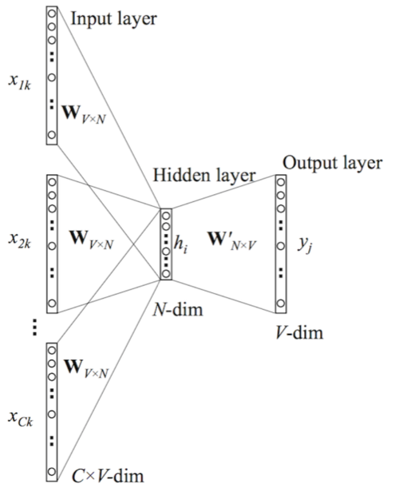
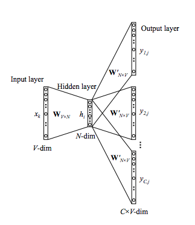

#什么是词向量

在介绍词向量之前我们先介绍下vector space model:

* 字典空间V
* 每一个词可以表示为一个V维的向量称作one-hot vector，这个词所在位置的向量元素值为1，否则为0, 举例:字典空间<am,is,are,this>, am的表示是[1,0,0,0]

词向量是将一个词映射到一个N维的实数向量上，目的要做到相近语义的次词向量也比较接近，体现为两个向量cosine的值较大，这便于从计算机角度比较两个词的相似性

# 为什么需要词向量

有时候我们需要表达字面意思之外的相似性来满足场景上的需求
比如年龄、几岁，再比如母亲节、康奶昔，这些词在one-hot vector上的表示是正交的，但从语义上他们是有相关性的。

# Word2Vector方法
word2vector本身是一个单隐层神经网络，用训练完的网络的输入层和隐藏层的权重来表示每个词的词向量，这里介绍两种方法: CBOW(continuous bag of words)和Skig Gram

## BOW
下图是CBOW的网络结构

这里使用某个词
前后的若干个词作为输入，作为要预测的输出，这里假设窗口大小为4，也就是用连续的5个词中间的词作为, 前后各两个词作为输入, , , ，这里的是一个one-hot vector，大小是词典的大小V。由于这里是4个one-hot vector，但图中我们看到输入和隐藏层是一个权重矩阵，那这个输入到隐藏层是如何计算的呢，论文和各种文章里会介绍将这4个向量拼成了一个的向量，然后计算隐藏层的输出，这个解释会让大家很困惑，实际上做法是分别和做矩阵乘法然后计算平均值，换一个思维是实际上的输入是：/4)，这样理解起来就简单了，相当于还是一个V维的输入向量，这里面还有一个特殊的地方是隐藏层是没有激活函数的，所以隐藏层的输出向量/4)，注意这里4是为了举例子，实际情况中根据窗口大小来调整。

### BOW loss function
以下是参考论文和网上文章中的公式推导，便于了解BP的原理，使用现成的library中有很多参数会和这些推导过程相关，了解之后有助于使用。

假设window size是C个词(表示上下文context):，那么隐藏层

定义Loss function E如下：

)

)

)

对输出层softmax之前的u做偏微分：

其中)

对隐藏层到输出层的权重做偏微分：

隐藏层到输出层的权重更新：

对隐藏层的输出做偏微分：

输入层到隐藏层的权重更新：

## Skip-Gram

这个模型可以看做CBOW模型的翻转，现在输入变成了某一个词，输出变成了这个词的上下文(context)

这时候隐藏层的输出为

由于隐藏层到输出层的权重是共享的，所以每个输出是相同的

=y_{c,j}=\frac{\exp(u_{c,j})}{\sum_{j^\prime=1}^{V}\exp(u_{j^\prime})})其中, 是隐藏层到输出层参数矩阵的某一列

### Skip-Gram loss function
我们先定义Loss Function， 最大化给定w情况下上下文的输出概率，反过来就是最小化这个概率的负数，如下：

=-\log\prod_{c=1}^C\frac{\exp(u_{c,j_c^*})}{\sum_{j^\prime=1}^{V}\exp(u_j^\prime)})

)

计算E的偏微分:

为了简化，我们定义，其中

针对隐藏层到输出层的权重计算偏微分：

则隐藏层到输出层的更新函数为：

输入层到隐藏层的更新函数可以参考BOW中的分析：
其中

# 参考
[word2exp explaination](http://www-personal.umich.edu/~ronxin/pdf/w2vexp.pdf)
[dl4j word2vec](https://deeplearning4j.org/word2vec.html)